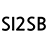

#  Simple Icon To-badge
 

## Chrome Extension
It is still under review and not listed in the chrome extension store.
if you want to use this extension,
1. clone this repository
2. enable developer mode on chrome://extensions
3. click `Load unpacked`
4. select the directory

## Feature

This extension is utilized by simpleicons.org to generate badges for shields.io. 

When you click on the details (finder button) on simpleicons.org, the details window will show you the badge for shields.io that you want to create and allow you to select elements like color/style.

For your convenience, clicking on the created badge will copy the image address of the badge to the clipboard.

## Example

https://github.com/user-attachments/assets/d17dbab0-a38f-468a-a613-c18b3fa0f92d

